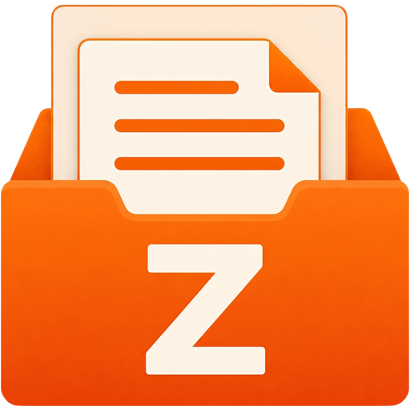

<div align="center">
  
  <h1>Z-Organizer</h1>
  <p>
    <a href="https://github.com/DanMixerBR/Z-Organizer/releases/latest"></a>
    <a href="https://img.shields.io/badge/platform-Windows%20%7C%20Linux-orange.svg"></a>
    <a href="https://www.python.org/downloads/release/python-3120/"></a>
    <br>
    <a href="DONATE.md"></a>
    <a href="LICENSE"></a>
  </p>
  <p>The ultimate cross-platform file organizer. Declutter your files and folders in seconds with smart rules, hybrid conditions, and automated classification.</p>
  <p><b>Developed with 💻 by DanMixerBR</b></p>
</div>


## ✨ Features

* **🤖 Auto-Classification:** Group files with a single click by Type (Videos, Documents, etc.), Creation Date, Modified Date, Size, or Alphabetical Order.
* **⚙️ Hybrid Rule Engine:** Create your own exceptions (e.g., "If the name contains 'Vacation', move it to the 'Travel' folder").
* **🛡️ Collision Prevention:** Never lose a file. If there are identically named files in different subfolders, Z-Organizer smartly renames them `(1)` to prevent overwriting.
* **🔍 Duplicate Hunter:** Scans the MD5 Hash of your files, isolating true clones at blazing speeds (Size-first filtering).
* **⏪ Time Machine (Undo):** Made a mistake? Undo the last organization and watch your files and folders return exactly to their original structure.
* **👁️ Dry Run (Simulation):** View an interactive, graphical folder tree of how your directories will look before moving a single byte.
* **🔄 OTA Updates:** Built-in auto-update system with security verification (SHA-256 Hash).

## 📸 Screenshots

<p align="center">
  
  <br>
  <em>Light Theme.</em>
</p>

<p align="center">
  
  <br>
  <em>Dark Theme.</em>
</p>

## 🚀 How to Use (No Installation Required)

Simply download the portable executable for your operating system:

1. Go to the **[Releases](../../releases/latest)** tab.
2. Download `Z-Organizer_Windows.zip` (Windows) or `Z-Organizer_Linux.zip` (Linux).
3. Unzip to a folder of your choice and run `Z-Organizer`.

## 🛠️ For Developers (Running from source)

Clone the repository and install the dependencies:

```bash
git clone [https://github.com/DanMixerBR/Z-Organizer.git](https://github.com/DanMixerBR/Z-Organizer.git)
cd Z-Organizer
pip install -r requirements.txt
python main.py
