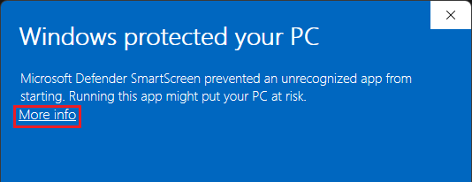
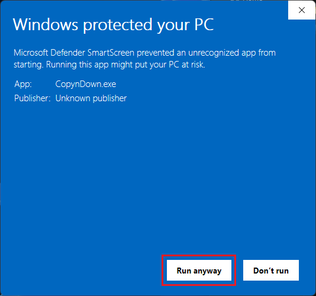

<div align="center">
  
  <h1>Z-Organizer</h1>
  <p>
    <a href="https://github.com/DanMixerBR/Z-Organizer/releases/latest"></a>
    <a href="https://img.shields.io/badge/platform-Windows%20%7C%20Linux-orange.svg"></a>
    <a href="https://www.python.org/downloads/release/python-3120/"></a>
    <br>
    <a href="DONATE.md"></a>
    <a href="LICENSE"></a>
  </p>
  <p>The ultimate cross-platform file organizer. Declutter your files and folders in seconds with smart rules, hybrid conditions, and automated classification.</p>
  <p><b>Developed with 💻 by DanMixerBR</b></p>
</div>


## ✨ Features

* **🤖 Auto-Classification:** Group files with a single click by Type (Videos, Documents, etc.), Creation Date, Modified Date, Size, or Alphabetical Order.
* **⚙️ Hybrid Rule Engine:** Create your own exceptions (e.g., "If the name contains 'Vacation', move it to the 'Travel' folder").
* **🛡️ Collision Prevention:** Never lose a file. If there are identically named files in different subfolders, Z-Organizer smartly renames them `(1)` to prevent overwriting.
* **🔍 Duplicate Hunter:** Scans the MD5 Hash of your files, isolating true clones at blazing speeds (Size-first filtering).
* **⏪ Time Machine (Undo):** Made a mistake? Undo the last organization and watch your files and folders return exactly to their original structure.
* **👁️ Dry Run (Simulation):** View an interactive, graphical folder tree of how your directories will look before moving a single byte.
* **🔄 OTA Updates:** Built-in auto-update system with security verification (SHA-256 Hash).

## 📸 Screenshots

<p align="center">
  
  <br>
  <em>Light Theme.</em>
</p>

<p align="center">
  
  <br>
  <em>Dark Theme.</em>
</p>

## 🚀 How to Use (No Installation Required)

Simply download the portable executable for your operating system:

1. Go to the **[Releases](../../releases/latest)** tab.
2. Download `Z-Organizer_Windows.zip` (Windows) or `Z-Organizer_Linux.zip` (Linux).
3. Unzip to a folder of your choice and run `Z-Organizer`.

## 🛡️ Troubleshooting

### Windows SmartScreen Warning (False Positive)
When running Z-Organizer for the first time on Windows, you might encounter a blue **Windows Defender SmartScreen** stating that it "protected your PC" from an unrecognized app.

**Why does this happen?**
Z-Organizer is an independent, open-source project. Because we haven't purchased an expensive Code Signing Certificate, Windows flags the `.exe` as an "Unknown Publisher" simply because it is new. 

**How to run Z-Organizer safely:**
It is completely safe to bypass this warning. To do so:
1. Click on **"More info"** at the end of the paragraph.
2. A new button will appear at the bottom. Click on **"Run anyway"**.




*Note: You will only need to do this once. If you want to verify the safety of the application, feel free to inspect the open-source code in this repository.*

## 🛡️ Security & Transparency

To ensure the safety of our users, every release is scanned for malware. Since the application is compiled from Python, some antivirus may trigger false positives. You can verify the latest scan results below:

| Platform | Status | Analysis Link |
| :--- | :--- | :--- |
| **Windows (.zip)** |  | [View Scan Report](https://www.virustotal.com/gui/file/cc2f4cbb4d0e33d4cfff559f2df5e1436e2bcb33ed6943ae7b73c2ba539736df/detection) |
| **Linux (.zip)** |  | [View Scan Report](https://www.virustotal.com/gui/file/9358c1d84220729cf7525da8b7d5a98889e11a33b4d5ed75a609f0881aefd15c/detection) |

> **Note:** If you encounter a "SmartScreen" warning on Windows, it is due to the lack of a paid EV Code Signing certificate. The project is fully open-source, and you can review the code at any time.

## 🛠️ For Developers (Running from source)

Clone the repository and install the dependencies:

```bash
git clone https://github.com/DanMixerBR/Z-Organizer.git
cd Z-Organizer
pip install -r requirements.txt
python main.py
